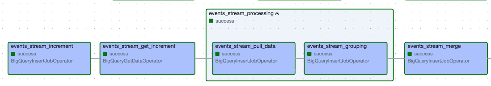
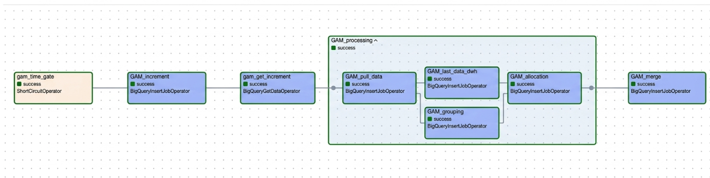
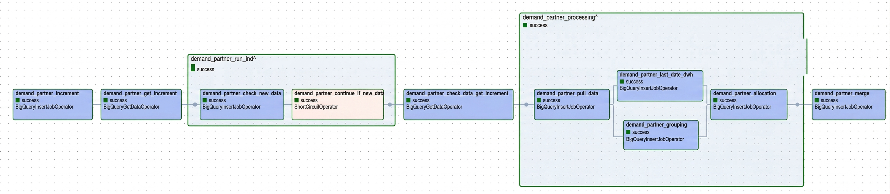
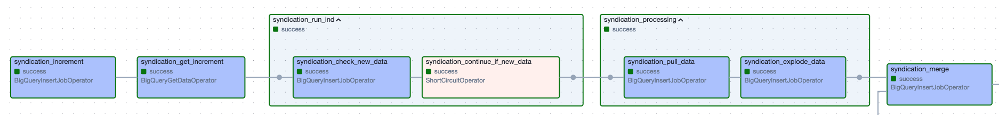
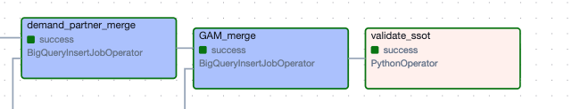
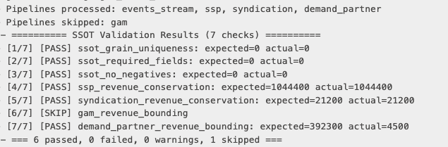

# Cross-Channel Revenue Consolidation Pipeline

## Table of Contents

1. [Executive Overview](#executive-overview)
2. [Architecture & Orchestration](#️-architecture--orchestration)
3. [Pipeline Designs](#️-pipeline-designs) *(click a section header to open its source folder 📂)*
   - [3.1 First-Party Events](#31-first-party-events-)
   - [3.2 GAM Data Transfer](#32-gam-data-transfer-)
   - [3.3 Demand Partners](#33-demand-partners-)
   - [3.4 SSP Report](#34-ssp-report-external-inventory-)
   - [3.5 Content Syndication](#35-content-syndication-)
4. [Schema Design](#️-schema-design)
5. [Automated Data Validation](#️-automated-data-validation-)
6. [Business & Technical Assumptions](#-business--technical-assumptions)
7. [Next Steps: Scaling via Independent Pipelines](#-next-steps-scaling-via-independent-pipelines)

---

## Executive Overview

- **The Problem:** Minute Media's revenue is generated across five siloed channels — first-party events, Google Ad Manager (GAM), MinuteSSP, external demand partners, and syndication — each operating at a different granularity, taxonomy, and delivery schedule. The absence of a unified layer makes accurate, automated, hourly revenue attribution impossible.

- **The Solution:** `fact_consolidated_revenue_hourly` — a BigQuery fact table providing hourly-granular, multi-source revenue reporting as the Single Source of Truth for Finance, BI, and Product teams.

- **The Approach:** An Apache Airflow DAG (`Model_consolidated_revenue_hourly`) orchestrates five independent sub-pipelines, each using an idempotent `MERGE` pattern into BigQuery to ensure data integrity and support incremental, replayable maintenance.

---

## 🏗️ Architecture & Orchestration

<p align="center">
  
</p>
<p align="center"><em>Airflow DAG: five parallel sub-pipelines converging into a sequential merge chain</em></p>

### DAG Execution Flow

A single DAG — `Model_consolidated_revenue_hourly` — runs on an **`@hourly`** schedule with `max_active_runs=1`. The five sub-pipelines execute their extract and transform steps in parallel, then merge into the SSOT in a strict sequential order to prevent concurrent BigQuery write conflicts:

```
events_stream_merge → ssp_merge → syndication_merge → demand_partner_merge → gam_merge
```

Each sub-pipeline is a self-contained unit following the same incremental pattern:

```
get_increment → check_new_data → pull_data → transform → merge
```

### Data Availability Strategy

Rather than relying on rigid cron-gated processing, each sub-pipeline has its own **`ShortCircuitOperator`** (`continue_if_new_data`) that independently checks whether new data has arrived for that source. This decoupling is deliberate:

- Each revenue source has a different delivery schedule and SLA (GAM: ~8h delay; demand partners: intraday per partner; SSP/syndication: daily batch)
- A missing SSP report must not block GAM reconciliation or event processing
- When a check returns false, the pipeline short-circuits cleanly; downstream merge tasks carry `trigger_rule="none_failed"` so the overall DAG chain continues uninterrupted

---

## ⚙️ Pipeline Designs

> 🔗 **[View Full DAG Definition & Orchestration Logic](./dags/minute_media/Model_consolidated_revenue_hourly/Model_consolidated_revenue_hourly.py)**

> 📂 *Section headers link directly to source folders — click the header to browse the SQL for that pipeline.*

Five sub-pipelines each own a single revenue source and contribute to the same SSOT table. All share the same idempotent incremental load contract.

### 🛡️ Idempotent Incremental Load Pattern

Every sub-pipeline follows the same five-step contract:

| Step | Description / Mechanism |
|:-----|:------------------------|
| **Increment** | Read `MAX(max_{source}_watermark)` from the committed SSOT (never staging) to prevent watermark drift on partial failures |
| **Check** | Short-circuit (`ShortCircuitOperator`) if `source_date > watermark`; skip the run entirely if nothing new has landed |
| **Pull** | Fetch with `source_date >= watermark`; inclusive boundary safely catches late-arriving data without duplicates |
| **Transform** | `CREATE OR REPLACE` staging table for grain normalization, dimension mapping, and daily→hourly explosion |
| **Merge** | `MERGE INTO fact_consolidated_revenue_hourly` with COALESCE-wrapped NULL-safe keys; UPSERT or UPDATE-only per pipeline |

### 📊 Pipeline Overview

| Pipeline | Source Table | Input Granularity | Merge Strategy | Execution Gate |
|:---------|:-------------|:------------------|:---------------|:---------------|
| **First-Party Events** | `events_stream` | Raw timestamps → hourly | UPSERT (insert + update) | Always runs |
| **GAM Data Transfer** | `fact_gam_data_transfer` | Timestamp → hourly | UPDATE only | Time-gated: 17:00 UTC |
| **Demand Partners** | `fact_demand_partner_reports` | Daily per partner | UPDATE only | Smart delta per partner |
| **SSP Report** | `fact_ssp_report` | Daily → 24 hourly rows | UPSERT | ShortCircuit on new data |
| **Content Syndication** | `fact_syndication_revenue` | Daily → 24 hourly rows | UPSERT | ShortCircuit on new data |

---

### 3.1 [First-Party Events](./dags/minute_media/Model_consolidated_revenue_hourly/fact_consolidated_revenue_hourly/events_stream) 📂

The **base layer** for all first-party traffic — both Owned-and-Operated (O&O) properties and B2B Publisher integrations. 

- Aggregates raw event timestamps to hourly grain
- Revenue Bifurcation — Splits revenue into two distinct columns to protect data integrity. By isolating finalized        MinuteSSP revenue from other estimated streams, we ensure that idempotent re-processing never degrades "actual" values back to "estimated" status.
  - **`actual_revenue`** — MinuteSSP only; CPM is finalized at auction close, so no later reconciliation is needed
  - **`estimated_revenue`** — all other networks; CPM is estimated at serving time and will be overwritten by GAM or demand partner reconciliation
- Maps `payingEntity → network` for Prebid-won impressions so that Magnite, Triplelift, and IndexExchange rows are attributed to the correct partner name at source
- Merge key spans 11 dimensions; all nullable fields wrapped in `COALESCE(field, 'NA')` for NULL-safe matching
- **UPSERT** strategy: inserts new grain combinations on first arrival; updates on reruns

<p align="center">
  
</p>

---

### 3.2 [GAM Data Transfer](./dags/minute_media/Model_consolidated_revenue_hourly/fact_consolidated_revenue_hourly/GAM) 📂

Reconciles actual **Google Ad Manager CPM** against the first-party event baseline for O&O properties, distributing revenue and impressions via proportional allocation weighted by `tracked_event_count` within each hourly partition.

- **Time-gated** to the 17:00 UTC DAG run (GAM has an ~8-hour delivery SLA, arriving by ~16:00 UTC; the 17:00 run guarantees a full hour buffer after delivery)
- Processes exactly `Increment + 1 day` per run to prevent partial-day allocation
- Dimension bridging via `dim_ad_unit_mapping` (GAM numeric IDs → DWH adunit paths) and `dim_country_mapping` (full names → ISO 2-letter codes)
- **UPDATE-only MERGE** — prevents ghost rows by enforcing that GAM revenue can only land where first-party events already exist

<p align="center">
  
</p>

---

### 3.3 [Demand Partners](./dags/minute_media/Model_consolidated_revenue_hourly/fact_consolidated_revenue_hourly/demand_partner) 📂

Reconciles CPM for **non-GAM, non-MinuteSSP networks**: Magnite, Triplelift, IndexExchange, and Prebid sub-partners.

- **Smart delta check:** rather than a simple watermark comparison, the check anti-joins all `(partner_name, report_date)` pairs in the source against processed `(network, event_date)` pairs already in the SSOT — returning the oldest unprocessed date. This allows multiple sub-pipeline triggers per day as different partners deliver their files independently
- **Proportional allocation** Distributes revenue based on hourly traffic volumes. If a report lacks ad-unit details, the revenue is shared across the entire site for those hours
- **UPDATE-only MERGE** — ghost-row protection ensures revenue is only attributed to rows with existing first-party activity

<p align="center">
  
</p>

---

### 3.4 [SSP Report (External Inventory)](./dags/minute_media/Model_consolidated_revenue_hourly/fact_consolidated_revenue_hourly/SSP) 📂

Adds **external supply-side platform activity** for inventory not tracked by first-party events (`site_type IN ('external', 'ext_player')`).

- Source is daily-granular per publisher; each `(publisher, report_date)` row is exploded to 24 hourly rows via `CROSS JOIN UNNEST(generate_timestamp_array(date_start, date_end, INTERVAL 1 HOUR))`
- **Daily → Hourly distribution:** revenue and impressions are divided evenly across hours:
  - `actual_revenue = revenue_usd / 24`
  - `reconciled_event_count = DIV(impressions, 24)` per hour; `MOD(impressions, 24)` remainder assigned to the first hour — guarantees exact conservation when summed back to daily
- Country codes standardized from 3-letter to 2-letter ISO via `dim_country_mapping`
- **UPSERT** strategy: these rows have no events_stream counterpart, so inserts are required

<p align="center">
  
</p>

---

### 3.5 [Content Syndication](./dags/minute_media/Model_consolidated_revenue_hourly/fact_consolidated_revenue_hourly/syndication) 📂

Tracks revenue from external sites (like Yahoo or MSN) that show our content. Since this happens on their platforms, we don't have our own tracking data for these views.

- Same daily → hourly explosion pattern: `CROSS JOIN UNNEST(generate_timestamp_array(...))`
- **Daily → Hourly distribution:** `actual_revenue = total_revenue / 24`; `reconciled_event_count = DIV(article_count, 24)` with `MOD` remainder on the first hour
- **UPSERT** strategy (no events_stream counterpart)

<p align="center">
  
</p>

---

## 🗄️ Schema Design

### dim_country_mapping

**Purpose:** Maps full country names (as delivered by GAM) to ISO 2-letter and 3-letter codes for standardized reporting.

```sql
CREATE TABLE IF NOT EXISTS `minute-media-490214.minute_media_DWH.dim_country_mapping` (
  country_name        STRING,
  country_code        STRING,
  country_code_alpha3 STRING
);
```

---

### dim_line_items_mapping

**Purpose:** Resolves GAM numeric line item IDs to human-readable advertiser names for downstream reporting.

```sql
CREATE TABLE IF NOT EXISTS `minute-media-490214.minute_media_DWH.dim_line_items_mapping` (
  line_item_id    STRING,
  advertiser_name STRING
);
```

---

### dim_ad_unit_mapping

**Purpose:** Translates partner-specific ad unit identifiers (GAM numeric IDs, Magnite/Triplelift paths) to canonical DWH ad unit paths.

```sql
CREATE TABLE IF NOT EXISTS `minute-media-490214.minute_media_DWH.dim_ad_unit_mapping` (
  partner_name    STRING,
  property_code   STRING,
  partner_ad_unit_name STRING,
  ad_unit_path    STRING,
  ad_unit_id      STRING
);
```

---

### events_stream

**Purpose:** Raw first-party event stream for all O&O properties and B2B publishers, retaining the last 60 days of data.

```sql
CREATE TABLE IF NOT EXISTS `minute-media-490214.minute_media_DWH.events_stream` (
  timestamp      TIMESTAMP,
  event          STRING,
  organizationId STRING,
  adunit         STRING,
  mediaType      STRING,
  network        STRING,
  payingEntity   STRING,
  domain         STRING,
  lineItem       STRING,
  adDealType     STRING,
  demandOwner    STRING,
  country        STRING,
  revenue        FLOAT64
)
PARTITION BY DATE(timestamp)
CLUSTER BY organizationId, network, event
OPTIONS (partition_expiration_days = 60);
```


---

### fact_gam_data_transfer

**Purpose:** Stores raw Google Ad Manager impression and CPM data, used to reconcile actual revenue against first-party event estimates.

```sql
CREATE TABLE IF NOT EXISTS `minute-media-490214.minute_media_DWH.fact_gam_data_transfer` (
  timestamp    TIMESTAMP,
  session_id   STRING,
  ad_unit_id   STRING,
  line_item_id STRING,
  country_name STRING,
  impressions  INT64,
  cpm_usd      FLOAT64
)
PARTITION BY DATE(timestamp)
CLUSTER BY ad_unit_id, line_item_id, country_name;
```


---

### fact_demand_partner_reports

**Purpose:** Holds daily revenue reports from multiple demand partners (for example Magnite, Triplelift, Index Exchange, etc.)

```sql
CREATE TABLE IF NOT EXISTS `minute-media-490214.minute_media_DWH.fact_demand_partner_reports` (
  report_date   DATE,
  partner_name  STRING,
  property_code STRING,
  ad_unit       STRING,
  geo           STRING,
  impressions   INT64,
  revenue_usd   FLOAT64
)
PARTITION BY report_date
CLUSTER BY partner_name, property_code;
```

---

### fact_ssp_report

**Purpose:** Contains daily external SSP inventory data for publishers not tracked by first-party events (`site_type IN ('external', 'ext_player')`).

```sql
CREATE TABLE IF NOT EXISTS `minute-media-490214.minute_media_DWH.fact_ssp_report` (
  report_date    DATE,
  publisher_id   STRING,
  placement_type STRING,
  site_type      STRING,
  country_code   STRING,
  impressions    INT64,
  revenue_usd    FLOAT64
)
PARTITION BY report_date
CLUSTER BY site_type, publisher_id, country_code;
```


---

### fact_syndication_revenue

**Purpose:** Tracks daily revenue from syndication partners (e.g., Yahoo, MSN) where content is shown on external platforms without first-party tracking.

```sql
CREATE TABLE IF NOT EXISTS `minute-media-490214.minute_media_DWH.fact_syndication_revenue` (
  transaction_date DATE,
  content_property STRING,
  partner_name     STRING,
  article_count    INT64,
  total_revenue    FLOAT64
)
PARTITION BY transaction_date
CLUSTER BY content_property, partner_name;
```


---

### fact_consolidated_revenue_hourly

**Purpose:** The final unified revenue table that combines all five channels into one hourly view, providing a single source of truth.

```sql
CREATE TABLE IF NOT EXISTS `minute-media-490214.minute_media_DWH.fact_consolidated_revenue_hourly` (
  -- Grain (13 dimensions)
  event_date              DATE,
  event_hour              TIMESTAMP,
  event                   STRING,
  organization_id         STRING,
  adunit                  STRING,
  media_type              STRING,
  network                 STRING,
  domain                  STRING,
  line_item               STRING,
  advertiser              STRING,
  ad_deal_type            STRING,
  demand_owner            STRING,
  country                 STRING,
  -- Metrics
  tracked_event_count     INT64,
  reconciled_event_count  INT64,
  actual_revenue          FLOAT64,
  estimated_revenue       FLOAT64,
  -- Watermarks (one per sub-pipeline)
  max_events_stream_timestamp TIMESTAMP,
  max_gam_timestamp           TIMESTAMP,
  max_demand_partner_date     DATE,
  max_ssp_date                DATE,
  max_syndication_date        DATE,
  -- Audit
  dwh_created_at          TIMESTAMP,
  dwh_updated_at          TIMESTAMP
)
PARTITION BY event_date
CLUSTER BY organization_id, network, event, country;
```

---

## 🛡️ [Automated Data Validation](/dags/minute_media/Model_consolidated_revenue_hourly/dq) 📂

<p align="center">
  
</p>

`validate_ssot` is the final gate in every DAG cycle — a `PythonOperator` that executes only after all five MERGE operations complete. It uses `BigQueryHook` to run SQL-based checks against BigQuery, each returning a structured result: `expected_value`, `actual_value`, and a boolean `passed` status.

**Pipeline-aware execution.** The system inspects the current `dag_run` to determine which sub-pipelines actually produced fresh STG data (via `dag_run.get_task_instance(task_id).state == "success"`). Pipeline-specific checks are triggered only for pipelines that ran — skipped pipelines emit `[SKIP]` and incur no compute.

**SSOT checks — always run, blocking (raises `AirflowException` on failure):**
- **Grain uniqueness** — zero duplicate rows across all 13 COALESCE-wrapped dimensions; a hit signals a broken MERGE ON clause
- **Required fields** — `event_date`, `event_hour`, `event`, `organization_id` must never be NULL
- **No negatives** — `actual_revenue`, `estimated_revenue`, `tracked_event_count`, and `reconciled_event_count` must all be ≥ 0

**Pipeline checks — conditional on STG freshness, non-blocking (logged as warnings):**
- **SSP & Syndication conservation** — grain-level JOIN between the STG explode table and the SSOT; total revenue must match within $0.01
- **GAM & Demand Partner bounding** — SSOT allocated revenue must not exceed STG source total by more than 0.1% 

A run is trusted only when all blocking checks pass. Validation results are logged directly to the Airflow task output. In a production environment, this architecture is designed to trigger automated **Slack alerts** upon failure for rapid incident response.

<p align="center">
  
</p>
<p align="center"><em>Sample validation output: 6 passed, 0 failed, 1 skipped (GAM pipeline time-gated out of this run)</em></p>

---

## 💡 Business & Technical Assumptions

- **O&O and B2B revenue follow distinct reconciliation boundaries.** GAM and demand partner reconciliation is scoped exclusively to O&O rows where first-party events already exist (UPDATE-only); external SSP and Syndication revenue — not captured server-side — is inserted directly as finalized `actual_revenue` with no reconciliation layer.

- **Demand partner reports are asynchronous and partner-scoped, not a single daily batch.** Different partners (Magnite, Triplelift, IndexExchange) deliver their files independently throughout the day. The Smart delta check anti-joins on `(partner_name, report_date)` pairs rather than a simple watermark, allowing the pipeline to trigger incrementally per partner without blocking or double-processing others.

- **The 17:00 UTC GAM gate is a business SLA decision.** GAM Data Transfer carries an ~8-hour delivery SLA (expected by ~16:00 UTC); locking processing to a single daily run at 17:00 UTC guarantees a complete allocation window and prevents partial-day revenue attribution that would distort hourly reporting.

- **`actual_revenue` and `estimated_revenue` are structurally separated at write-time.** MinuteSSP figures are recorded as finalized `actual_revenue` immediately upon auction close; all other sources write provisional `estimated_revenue`, which reconciliation updates in-place — ensuring idempotency and preventing pipeline reruns from degrading finalized values with raw estimates.

---

### 🚀 Next Steps: Scaling via Independent Pipelines

While the current single-DAG implementation successfully isolates task failures and provides a highly cohesive view of the reconciliation process, managing vastly different arrival schedules for multiple partners within one time-bound flow can become complex to maintain at scale.

To improve operational agility and scheduling flexibility, the natural evolution of this architecture is to decouple the process into 5 independent DAGs:

* **`events_stream` as the Core DAG:** This fast, near-real-time pipeline will serve as the foundational orchestration, establishing the base structure of the SSOT.
* **Standardized Independent DAGs:** Each external source (GAM, SSP, Content Syndication, etc.) will have its own DAG running on its specific, optimal schedule. Each DAG will process its data into a dedicated staging table at the exact same **hourly granularity**.
* **Smart, Event-Driven Updates:** Updates to the central SSOT will become modular. When a source DAG runs, it will check if new rows were added to its staging table.
  * **If new rows exist:** It will trigger its specific `UPDATE` / `MERGE` operation to push its revenue into the final `fact_consolidated_revenue_hourly` table.
  * **If no new data arrived:** It will simply **skip** the update path, ensuring zero wasted compute.

This decoupled approach maintains the robust fault tolerance already built into the system while making scheduling completely independent. It is cleaner to monitor, easier to maintain, and highly cost-efficient due to the dynamic skip logic.
